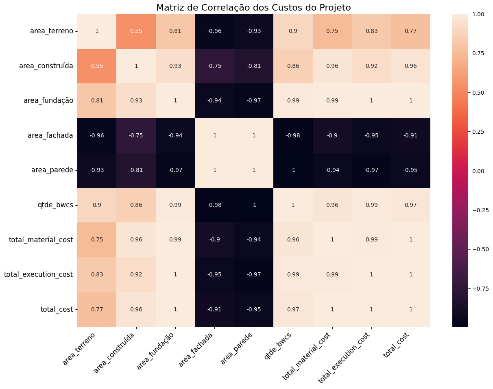
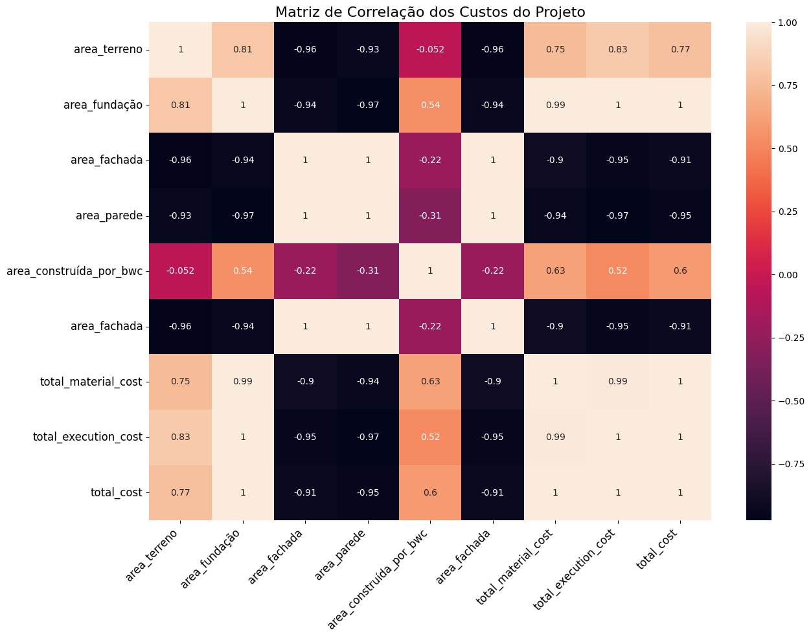
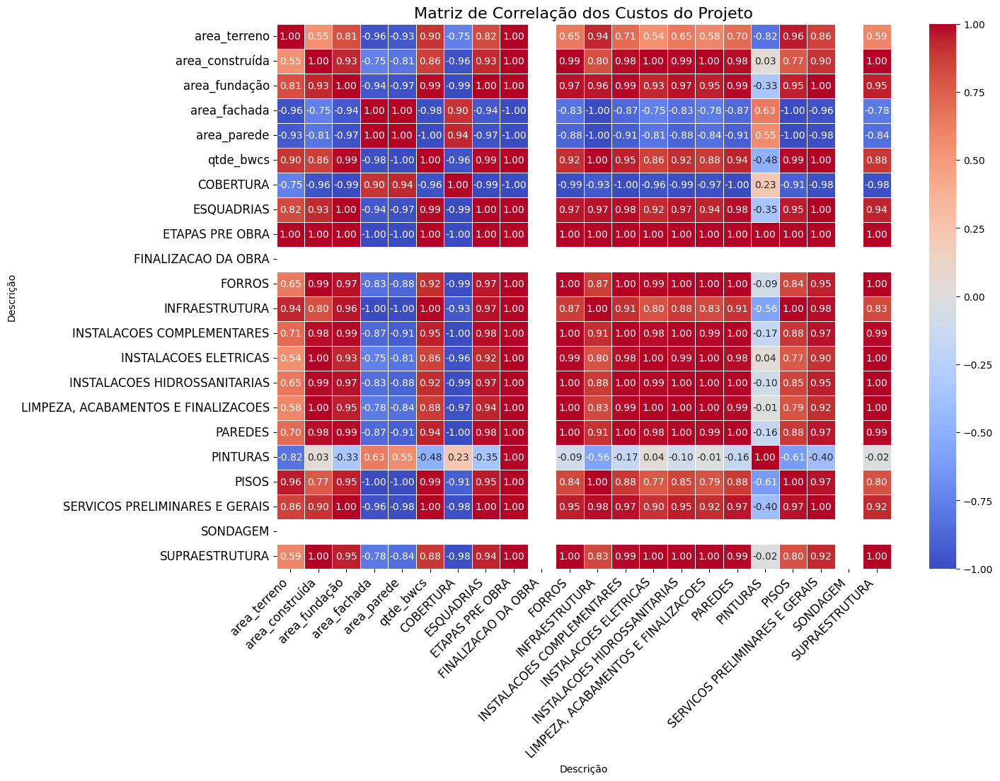
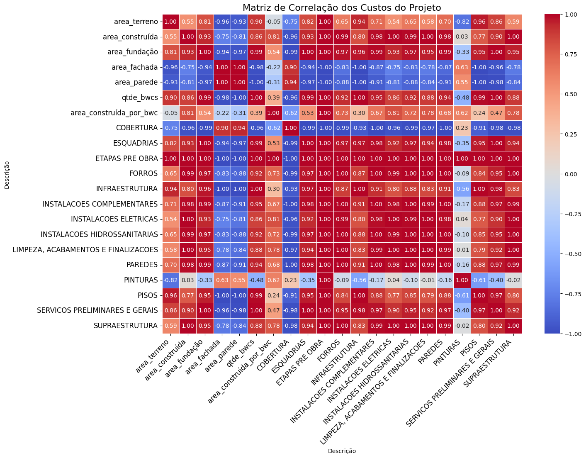

# Desafio de Ciência de Dados

## Introdução
- Objetivo do desafio
- Contexto do problema
- Importância da análise de dados

## Análise de Dados
**AVISO IMPORTANTÍSSIMO:**  
O conjunto de dados utilizado é extremamente pequeno e pode não ser representativo de um problema real. A análise de dados e o modelo de machine learning foram criados com base nesses dados, e não necessariamente refletem a realidade. O objetivo é mostrar o processo de análise de dados e machine learning, e não necessariamente criar um modelo preciso.

### Arquivos disponíveis
Foram disponibilizados 4 arquivos, sendo 4 csv e 1 xlsx. Os arquivos foram importados para o ambiente de desenvolvimento e carregados em DataFrames. Os arquivos mencionados são:
- 'amostra_projeto1.csv'
- 'amostra_projeto_2.csv'
- 'amostra_projeto_3.csv'
- 'projeto_4.csv'
- 'amostras_projetos.xlsx'

#### Estrutura
O arquivo .xlsx é um arquivo Excel que contém 4 planilhas, que correspondem aos arquivos csv mencionados acima. Cada planilha contém informações sobre um projeto específico.

Cada arquivo possui 2 tabelas, sendo uma um sumário do projeto e a outra uma tabela de orçamento dos itens do projeto. Com exceção do arquivo 'projeto_4.csv', que possui apenas o cabeçalho do projeto (header), afinal um dos objetivos é prever o orçamento dos itens do projeto.

Exemplo de tabela de sumário do projeto:

|       INFO       |       VALOR        |
|--------------------|--------------------|
| Titulo             | Projeto 1 - Wa     |
| Tipologia          | Térrea             |
| Área Terreno       | 485.00             |
| Área Construída    | 246.63             |
| Área Fundação      | 237.98             |
| Área Fachada       | 597.88             |
| Área Parede        | 615.86             |
| Qtde BWCs          | 5.00               |

Exemplo de tabela de orçamento do projeto:

| Item | Referência      | Tipo       | Código            | Descrição              | Unid. | Quantidade | BDI  | Preço Material | Preço Execução | Preço Unitário | Preço Total |
|------|-----------------|------------|-------------------|------------------------|-------|------------|------|----------------|----------------|----------------|-------------|
| 1.   |                 |            |                   | ETAPAS PRE OBRA        |       |            | 0.0% |                |                |                | $9,286.25   |
| 1.1. |                 |            |                   | SONDAGEM               |       |            | 0.0% |                |                |                | $3,000.00   |
| 1.1.1| MKS_COMPOSICOES | COMPOSICAO | CMP_INF-SON       | SONDAGEM               | VB    | 1          | 0.0% |                | $3,000.00      | $3,000.00      | $3,000.00   |
| 1.2. |                 |            |                   | LEVANTAMENTO TOPOGRAFICO|       |            | 0.0% |                |                |                | $2,400.00   |
| 1.2.1| MKS_COMPOSICOES | COMPOSICAO | CMP_INF-LVT       | LEVANTAMENTO TOPOGRAFICO| VB    | 2          | 0.0% |                | $1,200.00      | $1,200.00      | $2,400.00   |
| 1.3. |                 |            |                   | RESPONSABILIDADE TECNICA|       |            | 0.0% |                |                |                | $177.56     |
| 1.3.1| MKS_COMPOSICOES | COMPOSICAO | CMP_EPO-TAX-ART   | TAXA ART               | VB    | 2          | 0.0% |                | $88.78         | $88.78         | $177.56     |
| 1.4. |                 |            |                   | TAXAS DE APROVACAO     |       |            | 0.0% |                |                |                | $3,708.69   |
| ...  | ...             | ...        | ...               | ...                    | ...   | ...        | ...  | ...            | ...            | ...            | ...         |

### Pré-processamento dos dados
O primeiro passo foi realizar a leitura e importação dos dados. Como possuímos 2 tabelas em cada arquivo .csv (com exceçãoo do projeto 4), foi necessário ler cada tabela separadamente e armaezá-las em DataFrames distintos. Foi criado um dicionário de DataFrames para armazenar os DataFrames de cada arquivo e suas respectivas tabelas.

Alguns dados tiveram a necessidade de serem tratados, como a remoção de caracteres especiais, conversão de tipos de dados, e outros.

Alguns valores numéricos e monetários estavam como strings, foi necessário realizar a conversão para float. Exemplos:
    
-   4,00 (object) -> 4.00 (float)
-   $4,000.00 (object) -> 4000.00 (float)

    
Consulte a seção "Estruturas e Dataframes" para mais detalhes sobre a estrutura do dicionário.

### Exploração inicial dos dados
Após a importação dos dados, foi realizada uma exploração inicial dos dados. Foram verificados os tipos de dados, a presença de valores nulos, cabeçalhos e outras informações relevantes para a análise.

- Valores nulos: Os valores nulos são apropriados para esse problema. A presença de valores nulos pode indicar que o item não é de fato um objeto físico, mas sim um serviço ou etapa do projeto, é interessante checar os valores de Execução e Material, porém sempre haverá um valor total para cada entrada.

- Tipos de dados: Após o processamento dos dados, os tipos de dados foram ajustados para os tipos corretos. Os valores numéricos foram convertidos para float, e os valores monetários foram convertidos para float.

- Outliers: Não foram identificados outliers nos dados.

- Colinearidade: Há uma certa colinearidade entre algumas variáveis, como a quantidade de banheiros e a área construída. A quantidade de banheiros possui uma correlação positiva com o orçamento total do projeto. Quanto mais banheiros, maior o orçamento e área. Com isso, foi criada uma nova variável que é a razão entre a quantidade de banheiros e a área construída, que possui uma correlação positiva com o orçamento total do projeto.

### Insights obtidos

Primeiramente, ao juntar as tabelas de sumário do projeto e de orçamento, foi possível identificar algumas relações entre as variáveis.
A correlação entre as variáveis foi calculada e foi possível identificar algumas relações interessantes:

Nessa matriz simplificada podemos observar que:
- A quantidade de banheiros (BWCs) possui uma correlação positiva com o orçamento total do projeto. Quanto mais banheiros, maior o orçamento e área. Com isso, foi criada uma nova variável que é a razão entre a quantidade de banheiros e a área construída, que possui uma correlação positiva com o orçamento total do projeto.

- A área do terreno tem uma correlação média positiva com a área construída, o que nos leva a entender que não necessariamnte por se haver mais espaço terá mais construção. Possuindo mais dados de tipologia, poderíamos entender melhor essa relação entre espaço livre e construído.

<!---
- Ao trabalharmos com a razão entre a quantidade de banheiros e a área construída, percebemos que a correlação com o orçamento total do projeto é menor do que a quantidade de banheiros isoladamente. O que pode nos dar uma informação mais confiável sobre a relação dessas variáveis e o orçamento.

- A correlação entre banheiros por área construída agora é de 0.6, o que interpreta-se como uma correlação moderada. Isso nos dá uma informação mais confiável sobre a relação dessas variáveis e o orçamento.
--->
Para trabalharmos com as categorias únicas de orçamento no dataset e entendermos melhor a relação entre elas e as variáveis do projeto, foi necessário juntarmos as duas tabelas, header e orçamento, e agregarmos os valores de orçamento por categoria única. Com isso, foi possível criar uma matriz de correlação extendida, que nos dá uma visão mais ampla das relações entre as variáveis.
   

Essa é matriz de correlação contendo as _Categorias Únicas e seu total de orçamento_. 

<!---
Aqui está ela ajustada com a nova variável criada, a razão entre a quantidade de banheiros e a área construída.

--->

## Predições e Machine Learning
Nesse projeto a utilização de técnicas de machine learning e métodos estatísticos mais avançados foi um tanto limitada devido a quantidade de dados, afinal com apenas 3 projetos completos e 1 incompleto, não é possível criar um modelo de machine learning que generalize bem para novos dados. Além disso, até métricas de avaliação de modelos como o R² e RMSE não seriam confiáveis com tão poucos dados.

Porém, foi possível criar um modelo de regressão linear simples para prever o orçamento total do projeto com base em algumas variáveis. O modelo foi treinado com os dados dos projetos 1, 2 e 3, e testado com os dados do projeto 4.

### Variáveis utilizadas
As variáveis utilizadas para a previsão do orçamento total do projeto foram:
    - Tipologia
    - Área Construída
    - Área Terreno
    - Área Fachada
    - Área Parede
    - Valor Total 

### Encoding e Normalização
Para a utilização das variáveis categóricas, foi necessário realizar o encoding das variáveis categóricas. Foi utilizado o método de _One Hot Encoding_ para a variável _Tipologia_.

As variáveis numéricas foram normalizadas utilizando o método _MinMaxScaler_.

### Treinamento do modelo
Como temos poucos dados, foi utilizado o método de Leave One Out Cross Validation para treinar o modelo. O modelo foi treinado com os dados dos projetos 1, 2 e testado com o projeto 3. 

No caso da predição do projeto 4, o modelo foi treinado com os dados dos projetos 1, 2 e 3, e testado com o projeto 4.

### Resultados
Podemos separar os resultados por diferentes metodologias de treino e teste.
#### Leave One Out Cross Validation

## Conclusão
- Recapitulação dos principais pontos
- Resultados alcançados
- Lições aprendidas
- Próximos passos

## Referências
- Links para recursos utilizados
- Referências bibliográficas
